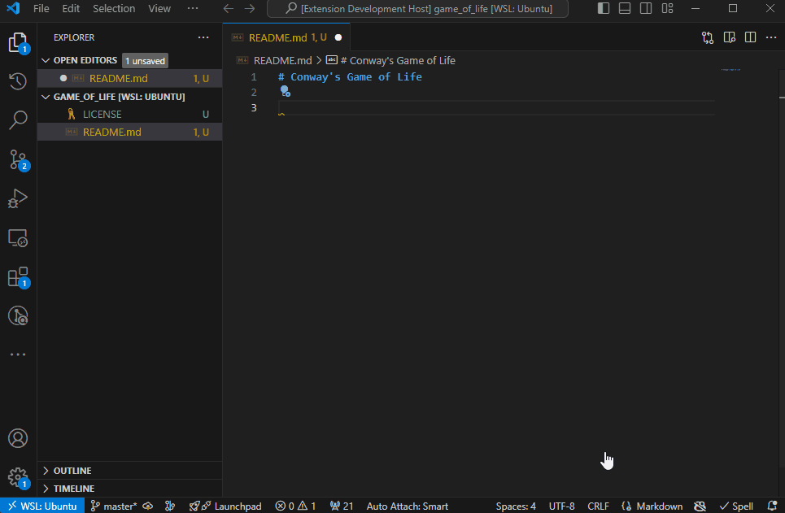

# Undo Tree

Like the Undo Tree addon found in [Vim](https://github.com/mbbill/undotree) or [Emacs](https://elpa.gnu.org/packages/undo-tree.html) but found right inside of VSCode! Quickly navigate the states of the code easier using 1 shortcut. Functions sort of like git!

Make changes and create a state with <kbd>ctrl</kbd>+<kbd>y</kbd> or <kbd>&#8984;</kbd>+<kbd>y</kbd> on MacOS. This will create a new child state to the initial state.

To go back a state to the parent state do <kbd>ctrl</kbd>+<kbd>alt</kbd>+<kbd>z</kbd>. Now to go back the new state, hit <kbd>ctrl</kbd>+<kbd>alt</kbd>+<kbd>y</kbd>. Make some more changes and hitting +<kbd>alt</kbd>+<kbd>z</kbd> will create a new state and undo.

Navigate easier using the sidebar and click to get to the desired state. You can even see the timecode of the changes if you toggle show timecode.

## Demo

## Features

All states can be accessed visually on the Undo Tree sidebar when you click on the history icon in the activity bar.

To create a save point do <kbd>ctrl</kbd>+<kbd>y</kbd> or <kbd>&#8984;</kbd>+<kbd>y</kbd> on MacOS. This will save your current changes in a state as a child to your previous save point.

To go back in history (or undo) hit <kbd>ctrl</kbd>+<kbd>alt</kbd>+<kbd>y</kbd>. To redo, hit <kbd>ctrl</kbd>+<kbd>alt</kbd>+<kbd>y</kbd>. This will go to your first save point if you have multiple under the parent node.

Toggle the timecode of when you made the changes by going to command palette and looking up `Undo Tree: Toggle Showing Timecode`.

Reset the tree by going to command palette and looking up `Undo Tree: Reset`. This will remove all the saved states.

> Tip: If you have a super large file, this extension may not be good for you since it stores the code of every node in memory.

<!-- ## Requirements

If you have any requirements or dependencies, add a section describing those and how to install and configure them.

## Extension Settings

Include if your extension adds any VS Code settings through the `contributes.configuration` extension point.

For example:

This extension contributes the following settings:

* `myExtension.enable`: Enable/disable this extension.
* `myExtension.thing`: Set to `blah` to do something. -->

## Issues

If there are any issues, we track it on [GitHub](https://github.com/Zeyu-Li/undo-tree-vscode) issues' tab.

Thanks in advance for reporting any issues

---

<!-- ## Following extension guidelines

Ensure that you've read through the extensions guidelines and follow the best practices for creating your extension.

* [Extension Guidelines](https://code.visualstudio.com/api/references/extension-guidelines) -->
